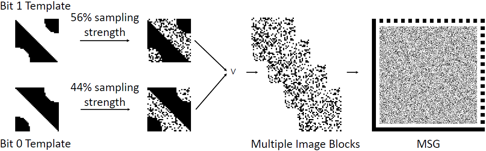
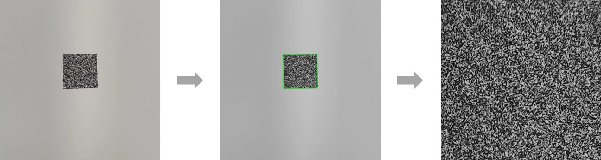

<div align="center">
<h1> Mixed-bit Sampling Graphic: When Watermarking Meets Copy Detection Pattern </h1>
  
Jiale Chen, Li Dong, Rangding Wang, Diqun Yan, and Chengbin Peng

Department of Computer Science, Ningbo University


</div>


# Introduction

1. Official implementation of the paper titled "Mixed-bit Sampling Graphic: When Watermarking Meets Copy Detection Pattern," as presented in IEEE Signal Processing Letters.
2. The corresponding dataset mentioned in this work is available at https://www.kaggle.com/datasets/chenoly/msg-cdp-dataset.
3. We have made a demo video, which is available at https://youtu.be/-70hjwh_r4g.
## Overview
We proposed Mixed-bit Sampling Graphic (MSG) by extending the Copy Detection Pattern (CDP) with a watermarking functionality. The watermark bits embedded by using random sampling of white pixels from two orthogonal templates. We formulated the generation of MSG as a constrained optimization problem and developed an algorithm to efficiently solve it. Experimental results demonstrate that MSG maintains the same anti-counterfeiting performance as conventional CDP, while providing watermarking capabilities that CDP lacks.

## Requirements
1. Python
2. bchlib==0.14.0
3. opencv-python
4. numpy
5. scikit-image
6. scipy

## Usage
The test codes are mainly divided two parts:
1. Generate a MSG by given parameters:
   
   ```python
    python encode_one_msg.py --save_path Images/ --data hello --N 36 --alpha 0.7 --gamma 0.06
   
2. Detect and Decode MSG from a captured image
   
   ```python
    python decode_one_msg.py --msg_path Images/captured_MSG.jpg --correct_size 324 --N 36

## Citing us
```bibtex
@journal{jiale2023spl,
	title        = {Mixed-bit Sampling Graphic: When Watermarking Meets Copy Detection Pattern},
	author       = {Jiale Chen, Li Dong, Rangding Wang, Diqun Yan and Chengbin Peng},
	year         = {2023},
	month        = {December},
	booktitle    = {IEEE Signal Processing Letters},
	pages        = {1--4}
}
```

